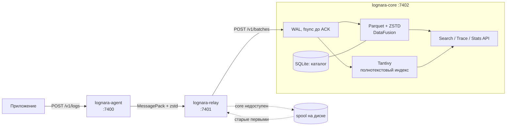

<div align="center">

# Lognara

**Сбор, хранение, поиск и аналитика логов на Rust**


</div>

Lognara принимает логи приложений, надёжно доставляет их на центральный сервер и позволяет искать по ним и строить статистику. Три небольших сервиса на Rust: **agent** живёт в контейнере рядом с приложением, **relay** один на машину, **core** хранит логи и отвечает на запросы. Core пишет приём в WAL, сохраняет данные в сегменты Parquet + ZSTD, ищет через Tantivy и считает аналитику через DataFusion.

## Как это работает



1. Приложение отправляет лог (text, JSON или байты) на `POST http://127.0.0.1:7400/v1/logs` агента.
2. Агент копит записи в памяти и отправляет пачку в relay, когда набрался `LOGNARA_BATCH_SIZE` или прошёл `LOGNARA_FLUSH_INTERVAL_MS`.
3. Relay разбирает записи в события, группирует по источнику и раз в интервал отправляет в core с Bearer-токеном. Пока core недоступен, пачки ждут в spool на диске.
4. Core подтверждает пачку (`204`) только после fsync WAL, затем материализует её в сегмент и публикует для поиска и аналитики.

## Возможности

| Компонент | Что делает | Ключевые свойства |
|-----------|------------|-------------------|
| [`Lognara-agent`](Lognara-agent) | Принимает логи по localhost, копит в памяти, отправляет в relay | `text/plain`, `application/json`, `application/octet-stream`; пачки MessagePack + zstd; ретраи с backoff; при переполнении вытесняются самые старые записи |
| [`Lognara-relay`](Lognara-relay) | Разбирает записи в события, группирует по источнику, отправляет в core | spool на диске с лимитом; порядок пачек сохраняется; деление по байтовым лимитам core |
| [`Lognara-core`](Lognara-core) | Хранит логи, ищет и считает статистику | WAL + fsync до ACK; дедупликация по SHA-256; полнотекстовый поиск, trace lookup, гистограммы и group-by; retention; метрики Prometheus |

### Гарантии доставки

- Доставка «хотя бы один раз»: core подтверждает пачку `204` только после fsync WAL, буфер в RAM не подтверждается.
- Повтор теми же байтами безопасен: core дедуплицирует по SHA-256 исходного сжатого тела пачки.
- Пока core недоступен, relay держит пачки в spool и отправляет от старых к новым.
- Потери (вытеснение из буфера, переполнение spool) не скрываются: они учитываются в счётчиках `dropped`.

## Быстрый старт

Нужен Rust 1.94 или новее. Общего Cargo workspace нет, каждый сервис собирается отдельно:

```sh
cargo build --release --manifest-path Lognara-core/Cargo.toml --bin lognara-core
cargo build --release --manifest-path Lognara-relay/Cargo.toml
cargo build --release --manifest-path Lognara-agent/Cargo.toml
```

Локальный запуск, три терминала (данные в `/tmp/lognara-demo`, токены произвольные):

```sh
# 1. core
LOGNARA_INGEST_TOKEN=ingest-secret \
LOGNARA_QUERY_TOKEN=query-secret \
LOGNARA_DATA_DIR=/tmp/lognara-demo/core \
Lognara-core/target/release/lognara-core

# 2. relay
LOGNARA_CORE_URL=http://127.0.0.1:7402/v1/batches \
LOGNARA_CORE_TOKEN=ingest-secret \
LOGNARA_SPOOL_DIR=/tmp/lognara-demo/spool \
LOGNARA_FLUSH_INTERVAL_MS=1000 \
Lognara-relay/target/release/lognara-relay

# 3. agent
LOGNARA_SERVICE=api \
LOGNARA_SERVER=local \
LOGNARA_BACKEND=demo \
LOGNARA_RELAY_URL=http://127.0.0.1:7401/v1/batches \
LOGNARA_FLUSH_INTERVAL_MS=1000 \
Lognara-agent/target/release/lognara-agent
```

Для демо интервалы сокращены до секунды: по умолчанию relay отправляет раз в 60 секунд, а агент по умолчанию ищет relay по имени `lognara-relay` в сети контейнеров.

Отправьте лог и найдите его:

```sh
curl -X POST http://127.0.0.1:7400/v1/logs \
  -H 'Content-Type: application/json' \
  -d '{"level":"error","message":"connection refused"}'

# через пару секунд
curl -X POST http://127.0.0.1:7402/v1/logs/search \
  -H 'Authorization: Bearer query-secret' \
  -H 'Content-Type: application/json' \
  -d '{"from":"2020-01-01T00:00:00Z","to":"2100-01-01T00:00:00Z","filters":{"level":["error"]},"text":{"query":"connection refused","mode":"phrase"}}'
```

## Порты и параметры

Все параметры задаются переменными окружения `LOGNARA_*` и проверяются при старте; при ошибке сервис завершается с кодом 1 и называет переменную.

| Сервис | Порт по умолчанию | Обязательные | Главные необязательные |
|--------|-------------------|--------------|------------------------|
| agent | `127.0.0.1:7400` | `LOGNARA_SERVICE`, `LOGNARA_SERVER`, `LOGNARA_BACKEND` | `LOGNARA_RELAY_URL`, `LOGNARA_BATCH_SIZE` (1000), `LOGNARA_FLUSH_INTERVAL_MS` (5000) |
| relay | `0.0.0.0:7401` | `LOGNARA_CORE_URL`, `LOGNARA_CORE_TOKEN` | `LOGNARA_SPOOL_DIR`, `LOGNARA_SPOOL_MAX_MB` (1024), `LOGNARA_FLUSH_INTERVAL_MS` (60000), `LOGNARA_BATCH_SIZE` (10000) |
| core | `127.0.0.1:7402` | `LOGNARA_INGEST_TOKEN`, `LOGNARA_QUERY_TOKEN` | `LOGNARA_DATA_DIR`, `LOGNARA_RETENTION_SECONDS` (604800) |

<details>
<summary>Все параметры agent и relay</summary>

**agent**

| Переменная | По умолчанию | Назначение |
|---|---|---|
| `LOGNARA_SERVICE` | обязательна | имя сервиса |
| `LOGNARA_SERVER` | обязательна | сервер или нода |
| `LOGNARA_BACKEND` | обязательна | backend |
| `LOGNARA_ENVIRONMENT` | нет | окружение |
| `LOGNARA_SERVICE_INSTANCE` | `$HOSTNAME`, если задан | экземпляр сервиса |
| `LOGNARA_BATCH_SIZE` | `1000` | размер пачки в записях |
| `LOGNARA_FLUSH_INTERVAL_MS` | `5000` | как часто отправлять накопленное |
| `LOGNARA_MAX_BUFFER` | `100000` | лимит записей в памяти, не меньше `BATCH_SIZE` |
| `LOGNARA_LISTEN_ADDR` | `127.0.0.1:7400` | адрес приёма |
| `LOGNARA_RELAY_URL` | `http://lognara-relay:7401/v1/batches` | адрес relay |

**relay**

| Переменная | По умолчанию | Назначение |
|---|---|---|
| `LOGNARA_CORE_URL` | обязательна | адрес core, схема `http` или `https` |
| `LOGNARA_CORE_TOKEN` | обязательна | Bearer-токен для core |
| `LOGNARA_FLUSH_INTERVAL_MS` | `60000` | интервал отправки в core |
| `LOGNARA_BATCH_SIZE` | `10000` | при таком числе событий пачка уходит раньше интервала |
| `LOGNARA_MAX_BUFFER` | `100000` | лимит событий в памяти; сверх него агенты получают `503` |
| `LOGNARA_LISTEN_ADDR` | `0.0.0.0:7401` | адрес приёма от агентов |
| `LOGNARA_SPOOL_DIR` | `/var/lib/lognara-relay/spool` | каталог spool |
| `LOGNARA_SPOOL_MAX_MB` | `1024` | лимит spool на диске |
| `LOGNARA_CORE_MAX_BODY_BYTES` | `67108864` | максимум сжатой пачки, не больше лимита core |
| `LOGNARA_CORE_MAX_DECODED_BYTES` | `268435456` | максимум MessagePack до сжатия, не больше лимита core |
| `LOGNARA_CORE_MAX_MODEL_BYTES` | `268435456` | бюджет модели, не больше лимита core |

Параметры core (лимиты, память, сегменты, retention) описаны в [эксплуатации core](Lognara-core/docs/operations.md#конфигурация).

</details>

## HTTP API core

| Метод и путь | Токен | Назначение |
|--------------|-------|------------|
| `POST /v1/batches` | ingest | приём пачки от relay, `204` после fsync WAL |
| `POST /v1/logs/search` | query | поиск по фильтрам и тексту, курсорная пагинация |
| `GET /v1/traces/{trace_id}` | query | события trace по возрастанию времени |
| `POST /v1/stats/histogram` | query | число событий по временным корзинам |
| `POST /v1/stats/group-by` | query | число событий по 1-2 полям |
| `GET /metrics` | query | метрики Prometheus |
| `GET /health/live`, `GET /health/ready` | нет | живость и готовность |

Форматы запросов и ответов, лимиты и коды ошибок: [`Lognara-core/README.md`](Lognara-core/README.md).

## Эксплуатация

Один процесс core владеет одним каталогом на локальном SSD; общая сетевая файловая система и несколько писателей не поддерживаются. HTTPS обеспечивает внешний прокси (например, nginx), core слушает loopback. SIGTERM и SIGINT завершают приём и дорабатывают WAL, после аварийного завершения подтверждённые данные восстанавливаются из WAL.

- [Эксплуатация core](Lognara-core/docs/operations.md): конфигурация, systemd и nginx, восстановление, retention, метрики.
- [Нагрузочная проверка](Lognara-core/docs/benchmark.md): стенд и критерии.

## Разработка

Тесты, форматирование и линтер запускаются для каждого сервиса отдельно:

```sh
cargo test   --manifest-path Lognara-core/Cargo.toml --all-features
cargo fmt    --manifest-path Lognara-core/Cargo.toml --check
cargo clippy --manifest-path Lognara-core/Cargo.toml --all-targets --all-features -- -D warnings
```

Те же команды с `Lognara-agent/Cargo.toml` и `Lognara-relay/Cargo.toml`. Тесты core запускают настоящий relay (dev-зависимость) и проверяют повтор после рестарта, SIGKILL после ACK, сбои публикации, индексы, курсоры и retention. Feature `crash-tests` включает только аварийные точки для тестов, для эксплуатации собирайте без неё.

## Структура репозитория

```text
Lognara-agent/            приём логов и отправка в relay
Lognara-relay/            разбор, группировка, spool, отправка в core
Lognara-core/             WAL, хранилище, поиск, аналитика, HTTP API
  docs/                   эксплуатация, нагрузочная проверка
Obsidian/LognaraVault/    база знаний проекта (открывается в Obsidian)
LICENSE                   MIT
```

## Статус и ограничения

- Версия 0.1.0, крейты не публикуются (`publish = false`).
- Dockerfile и готовых образов пока нет.
- Метрики агента и relay не поддерживаются.
- Core работает на одной ноде: без кластера и репликации, TLS не встроен.
- 10 000 событий/с на 4 CPU / 8 GiB это проверяемая цель, а не гарантия. Результаты приёмочного прогона ещё не записаны.

## Лицензия

[MIT](LICENSE)
